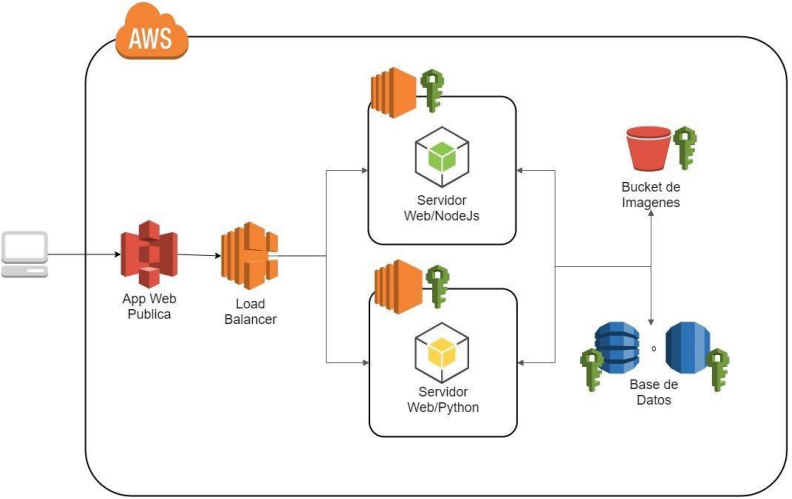
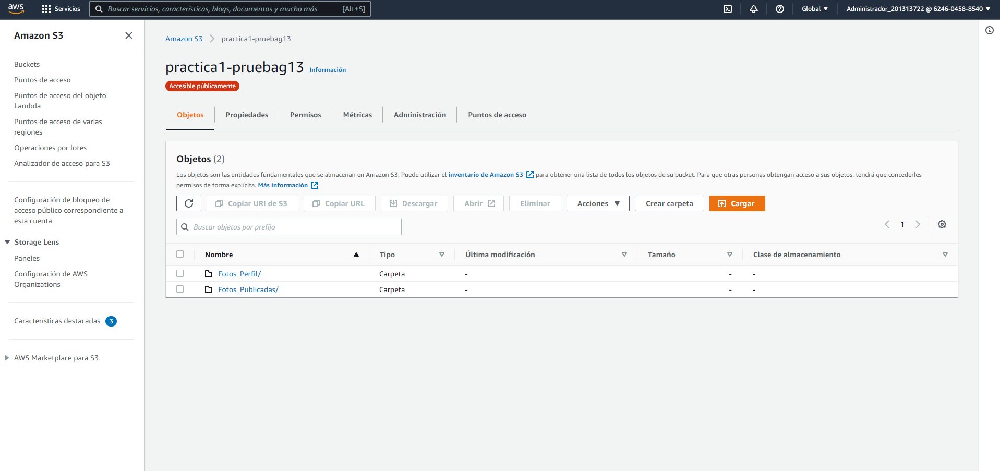
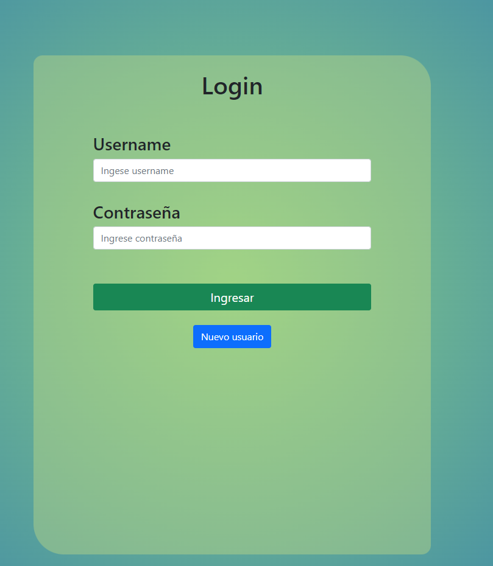
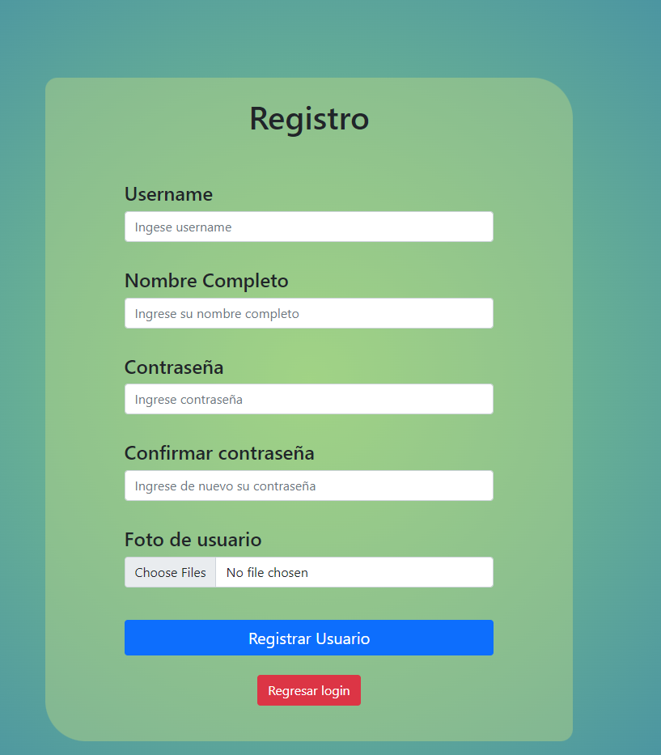
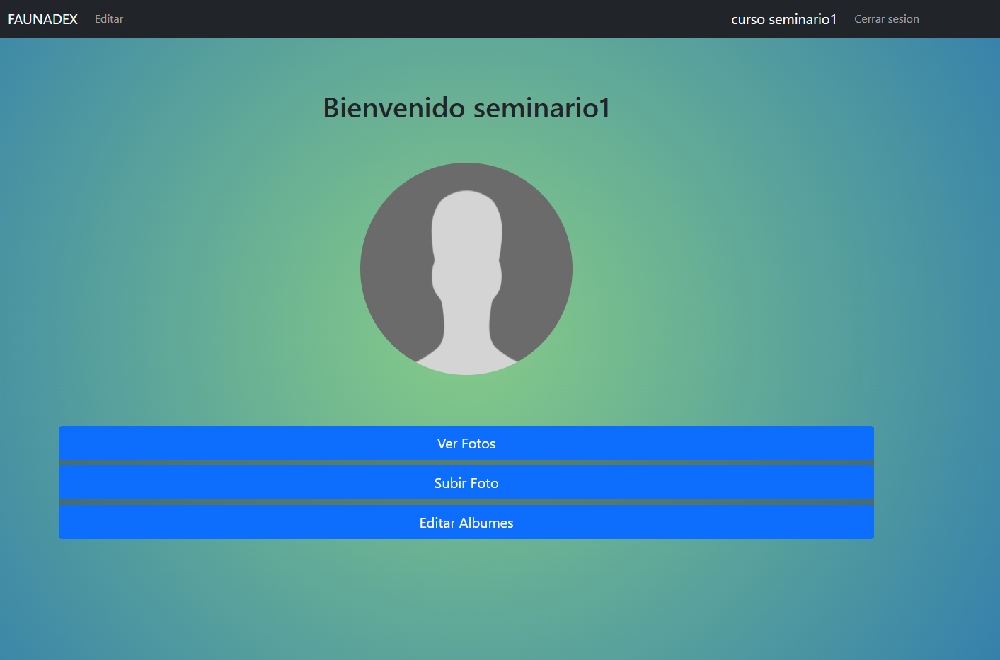
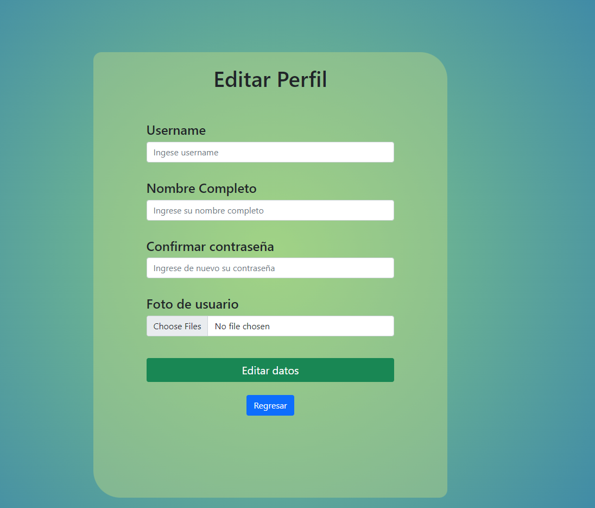
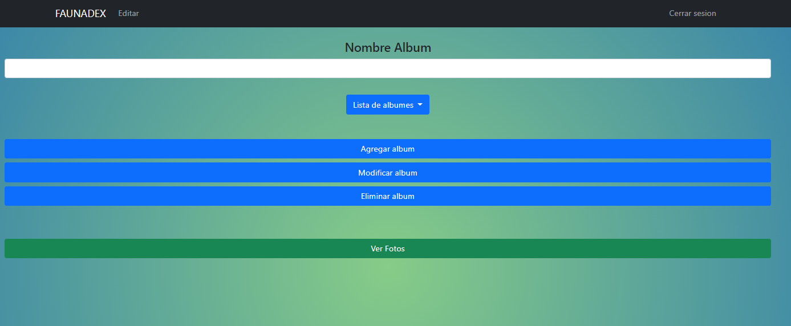
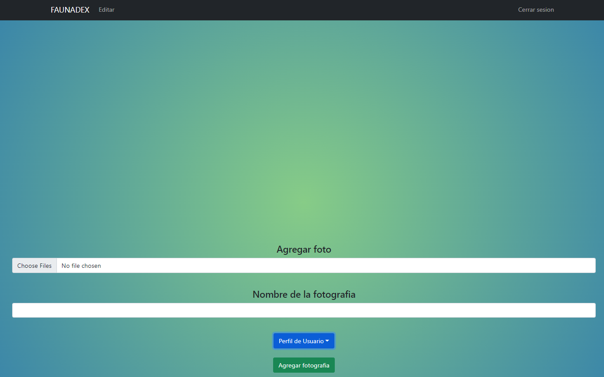

## Seminario 1 -  Practica1
#### Grupo13

### Integrantes

|   | NOMBRE                                      | CARNE     |
| - | ------------------------------------------- | --------- |
| 1 | Santiago Gilberto Antonio Rivadeneira Ruano | 201313722 |
| 2 | Edwin Alfredo Lopez Gomez                   | 201314007 |
| 3 | Wilfred Stewart Perez Solorzano             | 201408419 |
| 4 | Hector Josue Orozco Salazar                 | 201314296 |

# Arquitectura

* Load Balancer
     
* EC2
     Fueron utilizadas para realizar los servidores del backend, en los cuales uno fue implementado en NodeJS y el otro en python.   
* Bucket Imagenes
     
* Base de Datos
     Se utilizó una base de datos tradicional RDS con un servidor SQL Server en el cual se diseñó un modelo relacional y se crearon procedimientos almacenados en los que se realizaron transacciones para el manejo de los datos.

# Usuarios IAM

# Bucket S3

# EC2

# RDS

# Aplicacion Web

* Login
    
* Registro
    
* Pantalla Inicio
    
* Editar Perfil
    
* Editar Album
    
* Subir Foto
    
* Ver Foto
    

